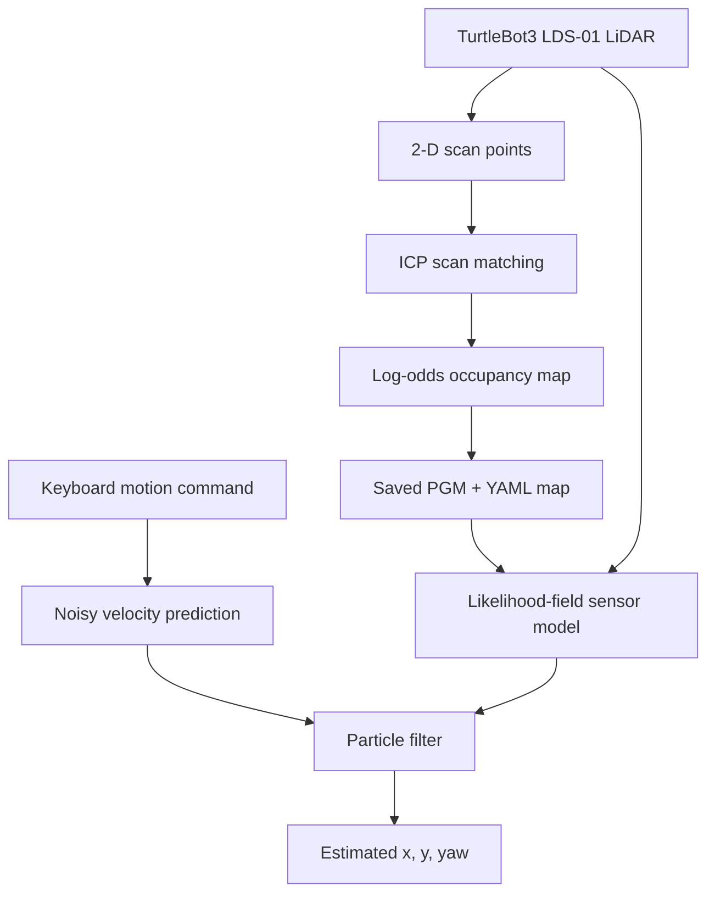

# Odometry-Free TurtleBot3 Mapping and Monte Carlo Localisation

An Intelligent Robotics assignment project for the **Webots TurtleBot3 Burger**, implemented in Python without ROS and without wheel-encoder odometry.

## What the project does

| Assignment task | Implementation |
|---|---|
| Task 1: Mapping | Teleoperation + command-seeded LiDAR scan-to-submap ICP + log-odds occupancy grid |
| Task 2: Localisation | Monte Carlo particle filter with commanded-velocity prediction + LiDAR likelihood-field correction |

Wheel positions and wheel velocities are never read. The wheel radius and axle length are used only to convert a requested robot velocity into motor commands. GPS, Compass, Supervisor pose and other ground-truth sources are not used by either algorithm.

## Pipeline



## Repository structure

```text
config/default.yaml                         Algorithm and robot parameters
controllers/mapping_controller/             Task 1 Webots controller
controllers/localization_controller/        Task 2 Webots controller
src/scan_matching.py                        2-D point-to-point ICP
src/occupancy_grid.py                       Inverse sensor model and map I/O
src/particle_filter.py                       MCL prediction, weighting and resampling
src/geometry.py                              SE(2), unicycle and actuation helpers
scripts/plot_results.py                      Report-ready result figure generator
scripts/analyze_results.py                   Reproducible result-metric calculator
scripts/prepare_and_run_webots.py            macOS Webots world/launcher automation
tests/test_core.py                           Webots-independent automated tests
run_mapping.command                          Double-click mapping launcher for macOS
run_localization.command                     Double-click localisation launcher for macOS
run_results.command                          Double-click result-analysis launcher for macOS
maps/                                        Generated map.pgm and map.yaml
results/                                     Runtime logs and generated figure
worlds/                                      Saved copy of the required sample world
docs/report_guidance.md                      Two-page report evidence checklist
```

## Requirements

- Webots R2025a
- Python 3.10–3.13 recommended
- Git

The project uses NumPy, Pillow, PyYAML and Matplotlib. Open3D and ROS are not required.

## 1. Install

### One-click macOS method

After extracting the project, double-click `run_mapping.command`. On the first launch, macOS may require **right-click → Open**. The launcher will:

1. Create `.venv` and install the requirements.
2. Run all automated tests.
3. Find `/Applications/Webots.app`.
4. Use the bundled R2025a-compatible arena, built from Webots base nodes plus the official tagged TurtleBot3 Burger PROTO. If it is absent, copy the locally installed sample as a fallback.
5. Assign `mapping_controller` and configure Webots to use the project Python environment.
6. Open Webots through macOS Launch Services in real-time mode, ensuring application resources resolve correctly.

After saving the map, double-click `run_localization.command` to verify its own Python environment and reopen the same world using the particle-filter controller.

### Manual/terminal method

```bash
git clone https://github.com/natrajengineer23-rgb/webots-turtlebot3-particle-filter.git
cd webots-turtlebot3-particle-filter
python3 -m venv .venv
source .venv/bin/activate
python3 -m pip install --upgrade pip
python3 -m pip install -r requirements.txt
python3 -m unittest discover -s tests -v
```

Expected result: **20 tests pass**. On Windows, activate with `.venv\Scripts\Activate.ps1`.

### macOS Webots Python setting

In Webots, open **Webots → Settings/Preferences → Python command** and select the project environment:

```text
/full/path/to/webots-turtlebot3-particle-filter/.venv/bin/python3
```

Do not select a Python 3.14 environment if one of the required packages is unavailable for it; Python 3.11 or 3.12 is the safest choice.

## 2. Prepare the required Webots world

1. Open Webots.
2. Select **File → Open Sample World**.
3. Open `robots → robotis → turtlebot → turtlebot3_burger.wbt` (some installations display `robots → robots → turtlebot`).
4. Select **File → Save World As…**.
5. Save it inside this repository as `worlds/turtlebot3_mapping.wbt`.
6. Select the `TurtleBot3Burger` node in the Scene Tree.
7. Set its `controller` field to `mapping_controller`.
8. Save and run the simulation.

The official TurtleBot3 Burger model provides the controller devices used here: `left wheel motor`, `right wheel motor` and `LDS-01`.

## 3. Task 1 — generate the map

Click inside the 3-D view before using the keyboard.

| Key | Action |
|---|---|
| Up or W | Move forward |
| Down or S | Move backward |
| Left or A | Rotate left |
| Right or D | Rotate right |
| M | Save the current map |
| Q | Save and exit |

Drive slowly through the complete environment. Pause and rotate at visually distinctive positions. Small movements keep the control-seeded scan-to-submap alignment within the correct correspondence basin.

The mapping controller produces:

- `maps/map.pgm`: black occupied cells, white free cells and grey unknown cells
- `maps/map.yaml`: map resolution, origin and occupancy thresholds
- `results/scan_matching_log.csv`: estimated trajectory, ICP RMSE, correspondence count and acceptance flag

The PGM file is the map image required in the report and must be included in the code submission with its YAML metadata.

## 4. Task 2 — run Monte Carlo localisation

1. Confirm `maps/map.pgm` and `maps/map.yaml` exist.
2. Reset the simulation to a known pose.
3. Change the TurtleBot3 `controller` field to `localization_controller`.
4. Save and run the world.
5. Drive using the same movement keys; press Q when finished.

At start-up, 800 particles are sampled globally over free map cells. Each control cycle applies the previous linear/angular command with Gaussian uncertainty. Each LiDAR correction projects beam endpoints into the map, scores their distance from the nearest occupied cell and normalises the particle weights. The joint measurement is tempered because neighbouring LiDAR beams are correlated. Systematic resampling, small Gaussian roughening and 2% global particle injection occur when

$$N_{\mathrm{eff}}=\frac{1}{\sum_i (w_i)^2}<0.5N.$$

The controller produces `results/localization_log.csv`, containing time, estimated pose, effective sample size, particle count and the applied commands.

## 5. Create report figures

After running Task 1 and Task 2:

```bash
source .venv/bin/activate
python3 scripts/plot_results.py
```

This creates `results/metrics_summary.csv` and `results/report_results.png`. The three-panel figure overlays the estimated trajectory on the occupancy map and presents ICP residual and particle-filter stability diagnostics.

### Recorded final run

The included final run contains 836 mapping updates and 607 localisation updates. Mean ICP RMSE was **0.00533 m** and its 95th percentile was **0.01108 m**. With 800 particles, median effective sample size was **450.9**, while 46/607 updates (7.6%) crossed the 280-particle resampling threshold. Estimated start-to-finish separation was **0.195 m**, or **0.063 m** when measured after the first 10 s of global initialisation. These are consistency measures rather than absolute localisation error because simulator ground truth was not used or logged.

## Algorithm details

### LiDAR-only mapping pose

The current LiDAR scan is aligned to a rolling eight-scan local submap using point-to-point ICP. The commanded velocity integrated between scans supplies the initial search pose, but no wheel state is read. Nearest-neighbour correspondences beyond `0.35 m` are rejected and the worst residuals are trimmed. The remaining pairs determine the least-squares rigid transformation through singular value decomposition. Excessive motion, correction or RMSE is rejected before inserting the scan into the grid; the command prediction is retained only as the next search prior.

### Occupancy-grid inverse sensor model

Bresenham ray tracing labels cells between the robot and each valid LiDAR endpoint as free. A valid endpoint is labelled occupied. Evidence is accumulated as bounded log odds:

$$l_{t}(m_i)=\operatorname{clip}\left(l_{t-1}(m_i)+l(z_t\mid m_i),l_{\min},l_{\max}\right).$$

### Monte Carlo localisation

The filter follows prediction, correction, normalisation, resampling and pose-estimation stages. Prediction uses the commanded twist—not measured wheel motion. The correction uses a likelihood field created from the saved occupancy map. Measurement tempering limits overconfidence from correlated beams, while post-resampling roughening and a small random injection reduce particle impoverishment. The fixed random seed in the configuration makes comparisons repeatable.

## Parameters

All important settings are in `config/default.yaml`. Begin with the supplied values. For experiments, vary only one factor at a time and record it:

- `particles`: try 100, 500 and 1,000
- `motion_noise`: control-model uncertainty
- `sensor_sigma`: width of the LiDAR likelihood model
- `beam_step`: measurement accuracy versus runtime
- ICP correspondence, trim and rejection thresholds

## Troubleshooting

- **Controller is not listed:** the saved world must be inside this repository's `worlds/` directory so Webots discovers the sibling `controllers/` directory.
- **A Python package is missing:** rerun the supplied launcher so it regenerates each controller's `runtime.ini` with the `.venv/bin/python3` path. Installing packages in another interpreter will not help Webots.
- **`LDS-01` or motor not found:** use the official TurtleBot3 Burger sample and retain the original device names.
- **Map doubles or tears:** move more slowly, shorten the distance between scans or reduce `update_every_steps` to 2.
- **Many `ICP rejected` messages:** rotate more slowly; then consider raising `icp_max_correspondence` slightly.
- **Particles do not converge:** verify the map has clear occupied/free regions, increase the count to 1,000 and check that the simulated starting pose lies inside mapped free space.
- **Map appears mirrored:** do not reverse the LiDAR range list independently; the controller already assigns bearings in the expected Webots order.

## Honest evaluation

Simulator ground truth may be recorded in a separate evaluation-only controller to calculate translation and heading errors, but it must never enter mapping or particle-filter updates. Only report experiments you actually run.

## Licence

MIT — see [LICENSE](LICENSE).
