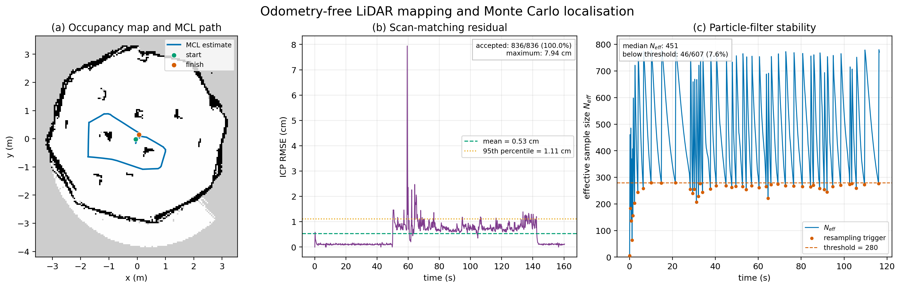

# Odometry-Free LiDAR Mapping and Monte Carlo Localisation of TurtleBot3 in Webots

**GitHub repository:** <https://github.com/natrajengineer23-rgb/webots-turtlebot3-particle-filter>

## 1. Mapping (Task 1)

The TurtleBot3 Burger was teleoperated through the supplied Webots environment using its LDS-01 LiDAR. Wheel encoders and Webots ground-truth pose were not read. Instead, each scan was aligned to a rolling eight-scan local submap using point-to-point iterative closest point (ICP). Integrated commanded linear and angular velocity supplied only the initial alignment guess. At every ICP iteration, nearest-neighbour pairs outside 0.35 m were rejected, the largest residuals were trimmed, and the remaining 2-D rigid transformation was calculated by singular value decomposition. Motion, correction and residual gates rejected implausible scan matches before map insertion.

The accepted pose and LiDAR beams updated a 0.05 m/cell log-odds occupancy grid. Bresenham ray tracing marked cells before each detected surface as free and the endpoint as occupied. This approach was selected because it estimates relative motion from environmental geometry and therefore avoids dependence on wheel odometry. Its main assumption is that consecutive scans overlap sufficiently and that the scene contains enough geometric structure.

The mapping run lasted 160.384 s and produced 836 scan-matching updates over an estimated 10.467 m path. All 836 matches passed the configured quality gates. Mean ICP RMSE was 0.00533 m, the median was 0.00645 m, the 95th percentile was 0.01108 m and the maximum transient residual was 0.07940 m. The map captures the arena boundary and internal obstacles. Duplicate boundary edges, small isolated occupied cells and an incomplete free-space boundary remain visible; these are consistent with accumulated scan-alignment error and limited coverage.

## 2. Monte Carlo Localisation (Task 2)

At localisation start-up, 800 particles were sampled globally over free map cells. The prediction stage propagated each particle using the previous commanded velocity with Gaussian uncertainty; measured wheel motion was never used. Every third controller step, every tenth LiDAR beam was projected from each particle into the map. A likelihood-field sensor model weighted particles according to endpoint distance from occupied cells. A measurement power of 0.35 tempered correlation between neighbouring beams. Weights were normalised before estimating pose. When

$$N_{eff}=\frac{1}{\sum_i w_i^2}<0.35N=280,$$

systematic resampling was followed by Gaussian roughening and 2% global particle injection to reduce particle impoverishment and support recovery from incorrect hypotheses.

The localisation run lasted 116.416 s and generated 607 updates along an estimated 8.597 m trajectory. Mean and median effective sample sizes were 477.2 and 450.9 particles. The threshold was crossed on 46 updates (7.6%), and subsequent rises in $N_{eff}$ show the effect of resampling. Estimated start-to-finish separation was 0.195 m using the first global estimate. Excluding the first 10 s of initial convergence reduced this separation to 0.063 m, demonstrating repeatable loop closure within the filter estimate.

The system worked reliably during slow motion and in regions containing asymmetric obstacle geometry. The fixed seed also made offline comparisons repeatable. Limitations include ambiguity in the approximately circular environment, dependence on the commanded rather than achieved velocity, sensitivity of ICP to rapid motion or insufficient overlap, map artefacts, finite grid resolution and particle depletion. Because supervisor ground truth was deliberately excluded and not logged, the reported separation is an internal consistency result—not absolute localisation accuracy. A future evaluation should log ground truth only to an isolated evaluation file, without making it available to either algorithm.

## References

[1] P. J. Besl and N. D. McKay, “A Method for Registration of 3-D Shapes,” *IEEE Transactions on Pattern Analysis and Machine Intelligence*, vol. 14, no. 2, pp. 239–256, 1992.

[2] S. Thrun, W. Burgard and D. Fox, *Probabilistic Robotics*. MIT Press, 2005.
